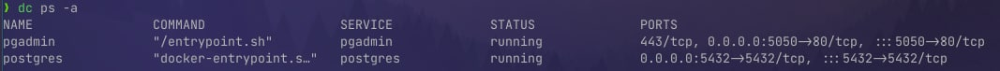
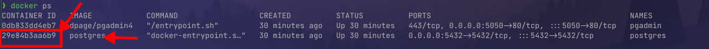
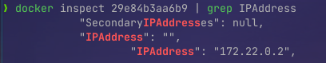
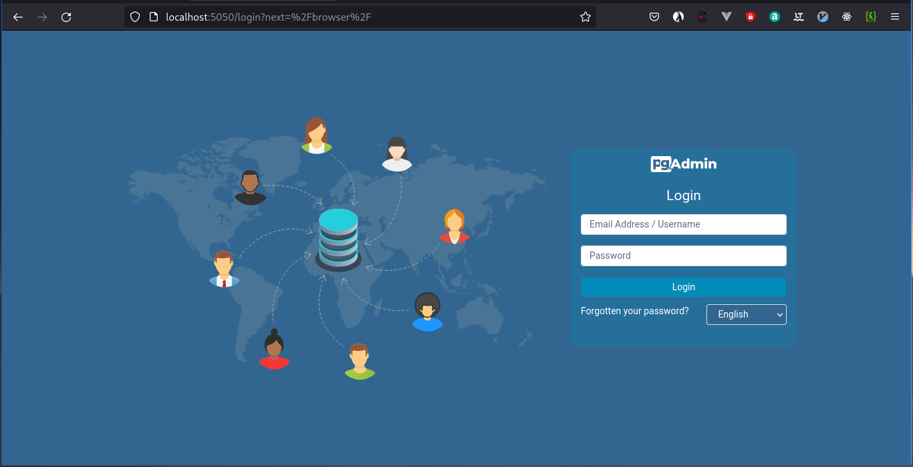
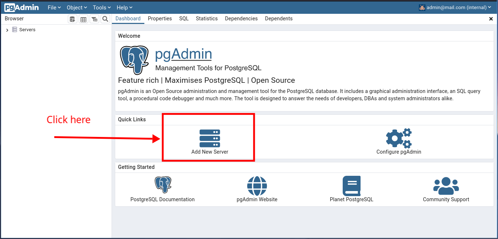
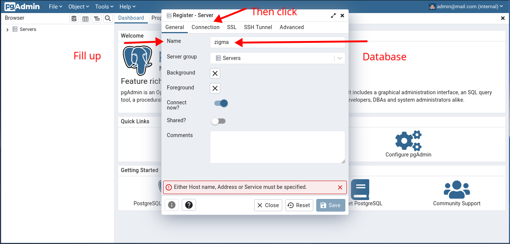
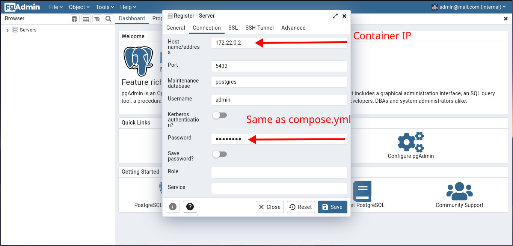
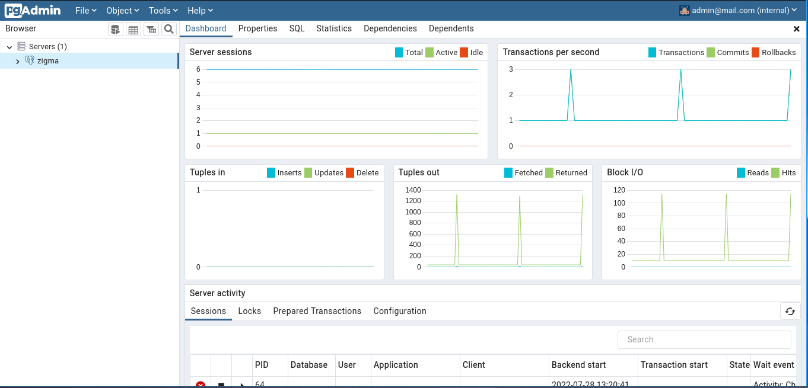

# Containers

Using command `docker-compose up -d` containers should be running,
it there's no images of postgre or pgAdmin those will be pulled from
dockerhub. Check it using `docker ps -a`, something like this should
be there:

To connecto to docker pgAdmin access [localhost:5050](http://localhost:5050)
get postgres container ip using `docker inspect <CONTAINER_ID>`, to get the
CONTAINER_ID, just run `docker ps -a`

Using the CONTAINER_ID we will get the container ip, so using 29e84b3aa6b9
we will inspect de id (29e84b3aa6b9 is my container id), to make this simpler
I will use grep also a bash pipeline, just like this

Using `docker inspect 29e84b3aa6b9 | grep "IPAddress"` I got 172.22.0.2 that's
my postgres container ip. Now I can got to pgAdmin at [localhost:5050](http://localhost:5050)

# PgAdmin

User is "admin@mail.com" and password "root"; same as compose.yml, Once we are in
we can connect to our database using "Add New Server" icon

Fill up "name" as you want, I will use my database name, then click on "connection"

Finally fill up "connection" using the data that you have, in this example password for DB
is "admin123", it's same as compose.yml

To check if everything is working just see if there's you server name mine is "Zigma"

